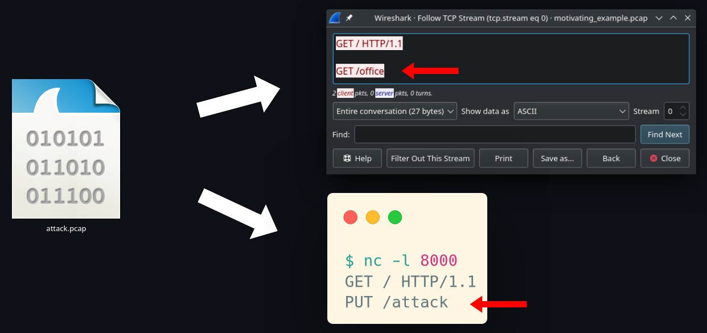

# TRT (TCP reassembly testing)

TRT is framework for testing the behaviour of different TCP
stream reassembly implementations. It can be used to test different
libraries of OS network stacks. The main goal of this effort is to
detect potential inconsistencies.

The figure below illustrates an inconsistency appearing between
Wireshark and Windows. The Inconsistencies exist because the TCP
standard doesn't cover how overlapping packages should be reassembled.

The Example in the image below contains three data packages that are
sent:

```
|   Package1   |  | Package2|
GET / HTTP/1.1\r..PUT /attack
................\nGET /office
                |  Package3 |
```

The packages are sent in order (1,2,3) and Positions indicate the
sequence numbers of the bytes (where bytes in the second row can overlap
things in the first row. The dots indicate missing bytes (holes in the
stream (except the one in the HTTP version of cause). I also can be
noted that `\r` and `\n` stand representative for only on special each
in the actual package data send.




## Installation
The whole project was developed on arch Linux

To simplify the installation of the project a `Dockerfile` is provided.

In order to build the docker image we have to `cd` into the base folder
of the repo (where the `Dockerfile` is located).
Here the following command can be run:
```sudo docker build --tag reassembly_test_framework .```

After that we can launch the Docker image interactively using:
```sudo docker run -i -t --network host reassembly_test_framework /bin/bash```

The `--network host` part of the command is important for using the
`test-os` subcommand of the test framework.

## Usage
Inside the docker image we can run `cd /home/test_framework`.
Inside this folder we can run `cargo run` to execute the framework. This
will list all the subcommands of the framework with an explanation.
It is important to run the `install` subcommand first.

### Testing libraries
The `test-lib` subcommand is meant to test TCP stream reassembly
libraries. By default all libraries present in the `bins_to_test` folder
are tested. There is however the possibility to test a single library by
using the `--name` option. 

#### Adding a library
Because the interfaces to TCP stream reassembly libraries can designed
in many different ways we need to define a common interface that can be
used by the testing framework. This interface is defined as follows: The
test framework expects a binary with a command line interface that takes
a `-f` option for a PCAP file. Other than that the binary has to use the
libraries stream reassembly functionality and print out __only__ the
reassembled result. The project files of the libraries are to be located
in the `libs` folder. Every sub folder in the `libs` directory has to
contain a `install.sh` and `clean.sh`. Those scripts are called by the
respective Test framework commands. The `install.sh` script has to
install the binary into the `bins_to_test` folder. There are two
options for installing a binary into to the `bins_to_test` folder. Fist
option is used when you have a self contained binary then just this
binary is placed inside the folder. Second option is used if the binary
is not self contained but uses other shared libraries are needed. Then
a folder is installed into the `bins_to_test`. The folder contains all
necessary dependencies and the main bin having the __same__ name as the
folder.

### Testing Operating Systems
The `test-os` subcommand is meant to test the TCP resembling behaviour of
various operating Systems. The subcommand takes a few options that it
needs in order to communicate with the target OS. Those are the target
__mac__/__ip__, the name of the __interface__ to use and the
__local port__ to be used. But before executing the command the
Operating System to be tested must execute the OS client that is
contained in the `os-client` folder.

In addition to that it will be necessary to put a firewall rule into
place that prevents the Kernel from sending RST packets. The sending of
the RST packets is caused by the receiving of packets on ports that the
Kernel is no using.

```sudo iptables -A OUTPUT -p tcp --tcp-flags RST RST -d 192.168.8.31 -j DROP```

In this command the IP 192.168.8.31 needs to be replaced with the ip of
target to test.

For local tests a virtual box running kali linux was used with the
network settings set to `Bridged Adapter` and then selecting the name of
the standard wifi card.
